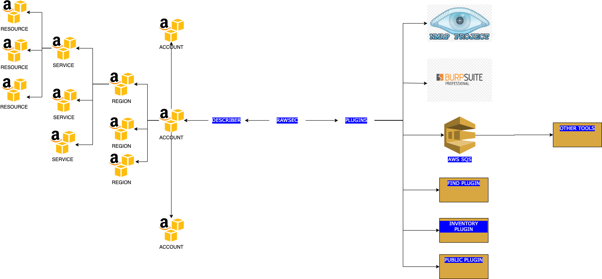

# RAWSEC (AWS Resourcer for Security Purposes: Inventory, Multi Scanner, and more)

This is WIP: Work in Progress

## Purpose

Working with different AWS accounts, services, and regions, could become really difficult when starting to scale.
If you want to have a complete picture about what is running, there is no easy way to do it, besides using diferent API calls. If you need to inventory, monitor, audit, or scan all of those resources from a single point, it's even harder.

This tool tries to solve this issue: by dynamically listing all AWS resources from any number of accounts, regions, and services all together, and providing this data in a sigle unified way, you can take bulk actions based on your needs.

Examples: list all resources that are publicly exposed, list all resources tagged in a certain way, list all resources not using encryption.

Each resource, indepently of the service, the account, or the region, could be listed in the same way and you can use them programatically to execute actions.

## Use Cases

- Security Scanning: Scannning your resources using different tools like Nmap or Burp (eg: Automated scan with Burp and Nmap all Public EC2 IPs, all Public Route 53 CNAMEs, all your Public CloudFront Distribution, or all together)
- Inventory: Inventoring all resources or a set of resources
- Find: Finding anything across all resources to understand if it's part of your scope (like an IP, an IAM Key or an S3 Bucket)
- Statistics: Counting how many resources with a specific configuration you have across your scope
- SQS/S3: Integrating asynchronously with any other software you are already using, with S3 or SQS

<p align="center">
  
</p>

## Describer

To solve these challenges, the first step is to have a complete list of all resources across accounts, regions, and services.
Describer Module takes care of that.

Information is downloaded and organized by resources, regardless of the account, the region, or the service:

```
{
  "RESOURCE ARN": {
    "account": "",
    "identifier": "",
    "region": "",
    "service": "",
    'data': List or Describe calls for the resource to fetch everything about it
  }
}
```

By default Describer Module will fetch all available services, but you can limit these by using `--services` and `--regions`.

AVAILABLE_SERVICES = [
    'rds',
    'ec2',
    'elb',
    'elbv2',
    'es',
    'cloudfront',
    'route53'
]

## Plugins

Plugins will use Describer data as input to execute actions. Actions can be whatever you need to do with that data.
The following is the list of default plugins as part of the tool.

Each plugin will add a new key to the resources that are being described.

Plugins can be configured only for certain services.

Plugins can be combined without any amount or order restriction.

### Public

Returns all public resources for AWS services

#### Examples

- `python3 rawsec.py -r eu-west-1 -p public` : Returns all public resources for all services in region `eu-west-1` for local account
- `python3 rawsec.py -s ec2 -p public` : Returns all public resources for service `ec2` in all regions for local account
- `python3 rawsec.py -p public -a 01234556789 9876543210 -ro SecurityAudit` : Returns all public resources for all services in all regions for accounts `01234556789` and `9876543210` assuming `SecurityAudit` role.

### Find

Finds a pattern across all resources

#### Examples

- `python3 rawsec.py -r eu-west-1 -p find -v find:127.0.0.1` : Find IP `127.0.0.1` across all resources in region `eu-west-1`
- `python3 rawsec.py -s ec2 -p find -v find:127.0.0.1` : Find IP `127.0.0.1` across service `ec2` in all regions
- `python3 rawsec.py -p find -v find:127.0.0.1 -a 01234556789 9876543210 -ro SecurityAudit` : Find IP `127.0.0.1` across all services in all regions for accounts `01234556789` and `9876543210` assuming `SecurityAudit` role.

### Inventory

Lists all resources with all the data fetched

#### Examples

- `python3 rawsec.py -r eu-west-1 -p inventory` : Return all resources for all services in region `eu-west-1`
- `python3 rawsec.py -s cloudfront -p inventory` : Return all resources for service `cloudfront` in all regions
- `python3 rawsec.py -p inventory -a 01234556789 9876543210 -ro SecurityAudit` : Return all resources for all services in all regions for accounts `01234556789` and `9876543210` assuming `SecurityAudit` role.

### NMap

Executes NMAp scan across public targets.

#### Examples

- `python3 rawsec.py -r eu-west-1 -p nmap` : Executes NMAp scan across all public services in region `eu-west-1`
- `python3 rawsec.py -s cloudfront -p nmap` : Executes NMAp scan for service `cloudfront` in all regions
- `python3 rawsec.py -p nmap -a 01234556789 9876543210 -ro SecurityAudit` : Executes NMAp scan for all services in all regions for accounts `01234556789` and `9876543210` assuming `SecurityAudit` role.

### Burp

Executes Burp scan across public targets.

You need to have an Enterprise/Profesional Burp license to use this plugin and enable REST Api (user Options -> Misc -> Rest API)

#### Examples

- `python3 rawsec.py -r eu-west-1 -p burp` : Executes Burp scan across all public services in region `eu-west-1`
- `python3 rawsec.py -s cloudfront -p burp` : Executes Burp scan for service `cloudfront` in all regions
- `python3 rawsec.py -p burp -a 01234556789 9876543210 -ro SecurityAudit` : Executes Burp scan for all services in all regions for accounts `01234556789` and `9876543210` assuming `SecurityAudit` role.